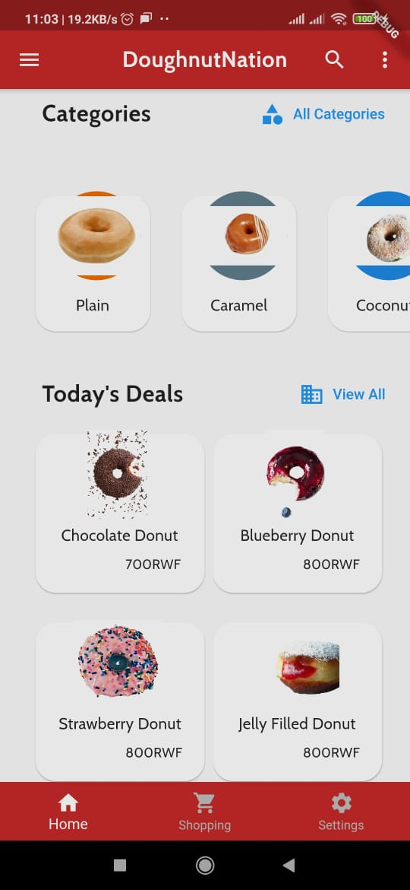
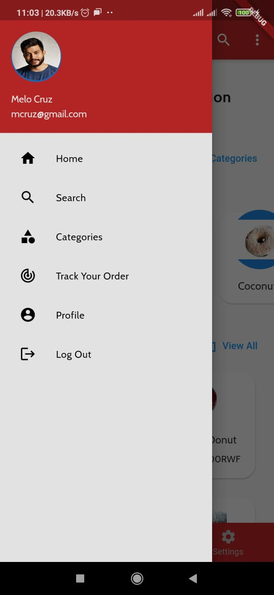
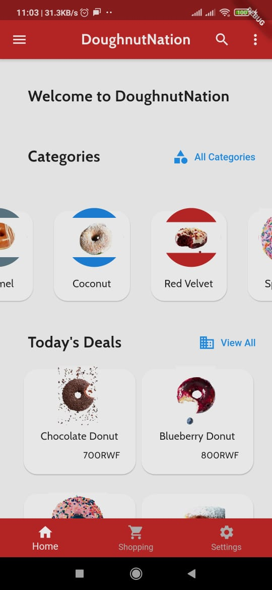
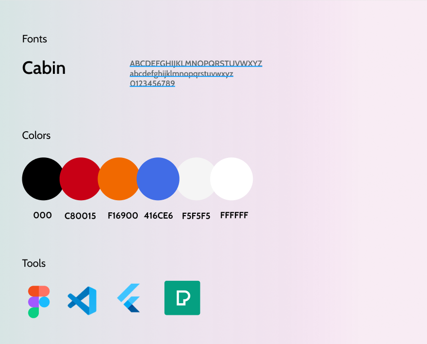

# Mini-Project1: ALU_RWA_MiniProject1_Wk3 - DoughnutNation, By Ian Kamanu Wanjohi

## Overview

In this project, I created a mock doughnut delivery app with Flutter called DoughnutNation. 

## How to Test

- Clone the Repo
- Make sure to cd to ALU_RWA_MiniProject1_Wk3
- Ensure you are running the latest version of Flutter and have set the PATH variable
- run: flutter run

## Resources Used

- GoogleFonts
- Flutter Launcher Icons
- Widgets: SingleChildScrollView, Scaffold, Container, OOP Classes, Rows, Drawers, Cards, TextButton, Icons, etc.

Find the screenshots below:

## Landing Page

## Today's Deals

## Menu Drawer

## Scrollable Categories

## Design Grid

## Contact
In case of any issues, feel free to reach me at i.wanjohi@alustudent.com
