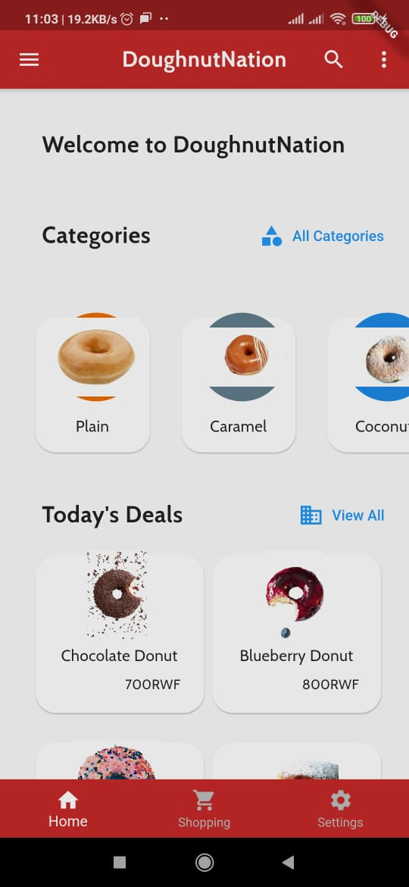

# Mini-Project1: ALU_RWA_MiniProject1_Wk3 - DoughnutNation, By Ian Kamanu Wanjohi

## Overview

In this project, I created a mock doughnut delivery app with Flutter called DoughnutNation. Find the screenshots below:

## Landing Page

## Today's Deals

## Menu Drawer

## Scrollable Categories

